L'Ordinateur Quantique, Mythe ou Réalité ?
==========================================

Michel Casabianca

casa@sweetohm.net

---
Proposition BDXIO 2017
----------------------

On entend parfois parler d'ordinateur quantique. Mais qui en a déjà vu un ?

Après une brève présentation des principes physiques sur lesquels repose l'ordinateur quantique (superposition et intrication quantiques), je présenterai le qubit ainsi que les principaux algorithmes quantiques (Grover pour la recherche et Shor pour la décomposition de nombres premiers). Je finirai sur les implémentations actuelles, les difficultés de mise ne œuvre, les perspectives et les enjeux de ces ordinateur d'un nouveau type.

---
Plan
----

- Pourquoi l'ordinateur quantique ?
  - La loi de Moore
  - Limites de l'informatique classique
  - Besoins croissant en puissance de calcul
- Principes de fonctionnement
  - Superposition quantique
  - Intrication quantique
  - Le qubit
  - Représentation de l'information
- Implémentations d'ordinateurs quantiques
  - Implémentations de qubits
  - Limites de l'ordinateur quantique
- Algorithmes quantiques
  - Exemples de mise en œuvre
  - Problèmes de prédilection
- Situation fin 2017
  - Situation actuelle
  - Perspectives

---
Pourquoi l'ordinateur Quantique ?
---------------------------------

Nos ordinateurs classiques nous ont suffi jusqu'à maintenant...


---
### La Loi de Moore

```bash
Le nombre de transistors dans les microprocesseurs double tous les deux ans.
```

Cette loi a été énoncée par Gordon E. Moore, l'un des trois fondateurs d'Intel, en 1975. Elle a été très bien vérifiée pendant de nombreuses années.

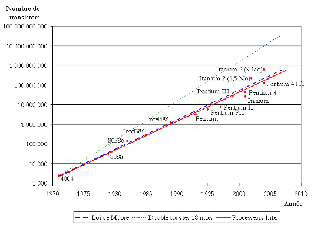

---
### Limites Physiques

Cependant, cette loi est **exponentielle**. Or nous savons tous que les lois exponentielles ne peuvent fonctionner qu'un temps, jusqu'à ce qu'on atteigne la **limite du système**.

En ce qui concerne les processeurs, les limites sont les suivantes :

- La **finesse de la gravure**, et donc le nombre de transistors par centimètre carré, est limitée par la **diffraction** de la lumière.
- L'**effet tunnel**, qui permet à un électron de passer une barrière à priori infranchissable, limite aussi la finesse des circuits.
- La **fréquence** est limitée par l'**émission de rayonnement** aux hautes fréquences ainsi que l'**émission de chaleur** par le processeur.

Ces limites physiques conduisent à plafonnement des performances des processeurs, et la fin de la validité de la loi de Moore a été annoncée en **2016**.

---
### Evolution des besoins en calcul

A titre d'exemple, voici l'évolution de la puissance des super-caculateurs de Météo France entre 1992 et 2016, l'échelle est **logarithmique** :

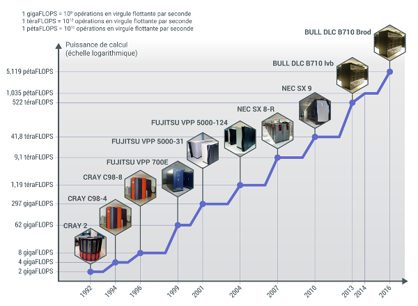

---
### Nombre d'ordinateurs croissant

Voici des estimations du nombre d'ordinateurs dans les datacenters des plus grandes entreprises du web :

- Google : plus de **1.000.000** (en janvier 2010).
- Microsoft : **1.000.000** (en janvier 2013).
- Amazon : **450.000** (en mars 2012).
- OVH : **140.000** (en mars 2013).

Les besoins en calculs des grandes entreprise est donc énorme et va croissant. La consommation des datacenters représente **2 % de la consommation modiale d'électricité**.

```bash
Les besoins croissants en puissance de calcul ainsi que les limites des
technologies actuelles rendent nécessaires des avancées majeures dans le
domaine du matériel informatique.
```

---
### Ordinateurs Quantiques

L'idée d'ordinateur quantique vient à **Richard Feynman** dans les années 80 :

```bash
Au lieu de nous plaindre que la simulation des phénomènes quantiques demande
des puissances énormes à nos ordinateurs actuels, utilisons la puissance de
calcul des phénomènes quantiques pour dépasser nos ordinateurs actuels.
```

L'idée est restée assez vague, jusqu'à ce que :

- En 1994, **Peter Shor**, chercheur chez AT&T, démontre qu'il est possible de factoriser de grands nombres en un temps raisonnable à l'aide d'un calculateur quantique.
- En 1996, **Lov Grover** invente un algorithme quantique qui permet de trouver une entrée dans une base de données non triée en *O(sqrt(N))*.

L'intérêt pratique de ces deux algorithmes, pour la **cryptographie** et la **recherche de données**, a poussé à l'implémentation concrète d'ordinateurs quantiques. Et il se trouve que les gens qui s'intéressent à ces domaines, comme la **NSA** ou **Google**, ont des moyens.

---
Principe de fonctionnement
--------------------------

Avant d'étudier le fonctionnement d'un ordinateur quantique, il nous faut *essayer* de comprendre deux principes de la physique quantique : **la superposition** et **l'intrication**.

**Avertissement**

Les notions que nous allons voir maintenant ne sont **pas intuitives** car le monde à notre échelle est régi par les lois de la physique classique. Les lois de l'évolution des espèces ont fait en sorte que nous soyons adaptés à cet univers **classique**.

Par conséquent, les images que nous utiliserons sont nécessairement limitées et **seules les mathématiques** nous permettent de modéliser correctement les lois de la physique quantique. Notre intuition ne peut plus rien faire pour nous dans le monde quantique.

---
### Superposition quantique

Une particule, qui est infiniment petite et donc régie par les lois de la physique quantique, peut se trouver dans un **état indéterminé** tant qu'on n'a pas mesuré son état.

Donc si une particule peut avoir deux états : soit *spin up* (représenté par *|u>*) soit *spin down* (représenté par *|d>*) alors, on peut représenter son état par :

```bash
a.|u> + b.|d>
```

Où *a* et *b* déterminent la **probabilité** d'observer la particule dans l'état *|u>* ou *|d>*. Par exemple, si la particule est nécessairement dans l'état *|u>*, alors on aura :

```bash
a = 1
b = 0
```

---
### Le coin du mathématicien

Les vecteurs d'état de la physique quantique n'ont rien à voir avec les vecteurs de la géométrie. En effet, les bases de l'espace vectoriel sont des états mutuellement exclusifs : une particule ne peut être simultanément dans l'état *|u>* et *|d>*.

De plus, lorsqu'on écrit un état quantique sous la forme :

```bash
a.|u> + b.|d>
```

- Cet état n'indique pas que la particule a un peu de *|u>* et un peu de *|d>*.
- Les coefficients *a* et *b* sont des nombres **complexes**.

Dans cet état, la probabilité de l'état *up* est *|a|²* et la probabilité de l'état *down* est *|b|²* et *a* et *b* vérifient *|a|² + |b|² = 1*.

La mathématique de la physique quantique est **l'algèbre linéaire**, qui nous parle de vecteurs et de matrices.

---
### Etrangeté quantique

On peut se dire que c'est pareil pour un système classique à deux états (comme une pièce de monnaie qui peut être *pile* ou *face*), mais il n'en est rien. En effet, même si on ne regarde pas la pièce de monnaie, on sait qu'elle est soit *pile* soit *face*.

Dans le cas de la particule quantique, c'est différent : avant la mesure, son état est une superposition des deux états.

On peut faire le parallèle avec un billet de loterie : **tant que le tirage n'a pas eu lieu, le billet est à la fois perdant ET gagnant**. Et ce n'est pas parce qu'on n'a pas bien observé le billet.

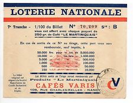

---
### Intrication quantique

Deux objets quantiques peuvent être **liés** de sorte que si l'on connait l'état de l'un, on peut en déduire l'état de l'autre. Ce phénomène s'appelle l'intrication quantique.

Ainsi, à l'issu de la désintégration d'une particule en deux autres, il peut arriver que les spins de ces deux particules soient intriqués. **Si on connait le spin de l'une on peut en déduire celui de l'autre**, et ce quelle que soit la distance qui les sépare.

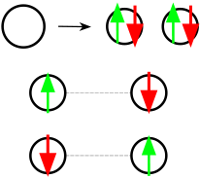

On peut expliquer ce phénomène par le fait que ces particules intriquées, qui peuvent être en nombre quelconque, forment **un seul système**.

---
### Les qubits

L'ordinateur *quantique* traite, comme son homologue *classique*, de l'information. La différence majeure entre ces deux types d'ordinateur est la manière de représenter cette information.

L'ordinateur classique représente l'information sous forme de **bits** (pour *binary digit*) qui peuvent avoir pour valeurs **0** ou **1**.

L'ordinateur quantique représente l'information à l'aide de **qubits** (pour *quantum binary digit*) qui a un état qui est une superposition de deux états, que l'on peut noter **|0>** et **|1>** :

```bash
a.|0> + b.|1>
```

Cela est possible du fait du principe de **superposition quantique**.

---
### Intérêt des qubits

L'intérêt de manipuler des qubits au lieu de bits est le suivant :

```bash
Les bits ne pouvant prendre qu'un état à la fois, il est souvent nécessaire
d'itérer sur de nombreuses valeurs pour réaliser un calcul. Au contraire, les
calculs réalisés avec des qubits opèrent sur toutes les valeurs en même temps.
```

Par exemple, pour **décomposer en facteurs premiers**, il nous faudra essayer de diviser par tous les nombres premiers inférieurs à la racine carrée. Un algorithme quantique ne procédera pas par essais successifs, mais travaillera avec des qubits qui prendront toutes les valeurs possibles.

Un nombre de *n bits* pouvant prendre *2ⁿ* valeurs, il faudra faire **2ⁿ itérations** pour balayer toutes les valeurs possibles avec des bits classiques, alors que toutes ces valeurs peuvent être représentées à la fois par **n qubits**.

```bash
On peut donc attendre une accéleration quantique de 2ⁿ avec un ordinateur
quantique à n qubits.
```

Pour **n = 50**, on obtient une accélération d'un facteur **1.125.899.906.842.624**, soit environ 1 million de millards...

---
Implémentations d'ordinateurs quantiques
----------------------------------------

Pour implémenter des qubits utilisables pour le calcul, il faut être capable de réaliser un système macroscopique ayant des propriétés quantiques pendant un temps suffisamment long.

On utilise actuellement, entre autres, les procédés suivants :

- Les **circuits supraconducteurs avec jonction Josephson** : technologie mise en œuvre par IBM depuis la fin des années 70 permettant d'envisager des circuits ayant une bonne résistance à la décohérence.

- Les **ions piégés** sont constitués de particules chargées piégées par des champs magnétiques dans des espaces clos et y sont contrôlés par laser. Ils permettent de mettre en œuvre le plus grand nombre de qubits.

Il existe un très grand nombre d'autres implémentations de qubits. Mais ce qu'il faut retenir, c'est que toutes sont délicates à mettre en place, et souvent à de **très basses températures** afin d'éviter les perturbations extérieures.

---
### L'ordinateur quantique d'IBM

Voici à quoi ressemble l'ordinateur quantique d'IBM :

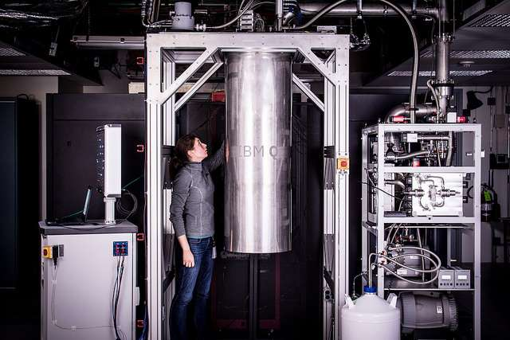

---
### Le processeur quantique d'IBM

Le processeur quantique IBM à 16 qubits :

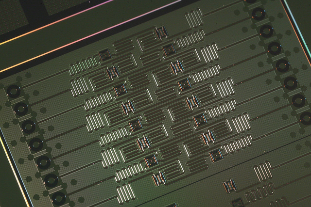

---
### Mise en œuvre

Au vu de la taille des installations nécessaires et de la complexité de mise en œuvre (installation cryogénique), on comprend que l'ordinateur quantique est confiné dans des **centres de calcul**.

D'autre part, du fait de la taille réduite des données en entrée et en sortie, typiquement quelques bits, on peut envisager des **accès par le web**.

Par conséquent, on ne peut s'attendre à un **usage grand public** de l'informatique quantique dans un futur proche, du moins sous la forme d'appareils possédés par des particuliers.

---
### Limites de l'ordinateur quantique

**Décohérence**

La décohérence résulte de l'action de l'environnement sur un système qui **perd alors ses propriétés quantiques**. Pour pouvoir réaliser un ordinateur quantique, les qubits doivent avoir une durée de cohérence supérieure au temps de calcul.

**Réduction du paquet d'onde**

Lorsqu'on lit le résultat du calcul, on réalise une mesure et donc les qubits deviennent de simples bits et par conséquent de simples *0* ou *1*. Les qubits ne le restent que le temps du calcul.

**Théorème de non clonage des qubits**

La copie est une opération classique en informatique. Lors d'une copie on doit lire l'état pour le recopier à l'identique ailleurs. Or en ce faisant, on réalise une mesure et par conséquent, les qubits redeviennent de simples bits.

Par conséquent, il est impossible de copier des qubits.

---
### Limites de l'ordinateur quantique (suite)

**Nombre de qubits**

Pour obtenir des résultats ayant des applications pratiques, il est nécessaire de disposer d'un grand nombre de qubits. Les implémentations actuelles restent limitées.

On estime actuellement qu'un ordinateur quantique sera supérieur à tout ordinateur classique au delà de **50 qubits**.

Cependant, certains problèmes spécifiques requièrent bien plus de qubits. Par exemple, pour factoriser de grands nombres, il faut disposer d'au moins autant de qubits qu'il y a de bits dans ce nombre. Donc en pratique plusieurs centaines, voire milliers.

Le faible nombre de qubits est à l'heure actuelle ce qui limite l'intérêt des ordinateurs quantiques disponibles.

---
Algorithmes quantiques
----------------------

Les algorithmes quantiques sont composés de **portes quantiques** appliquées aux qubits pour réaliser des opérations sur ceux-ci.

- En entrée, des **qubits sont préparés** dans des états donnés.
- En sortie, **on lit des bits**. Ce ne sont plus des qubits car la mesure du résultat fixe leur valeur et il n'y a plus de superposition d'états.

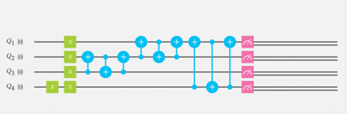

En pratique, on représente souvent les algorithmes sous forme d'une **partition** dans laquelle chaque ligne représente un qubit et où les portes quantiques sont placées sur ces lignes.

L'état d'un qubit étant **probabiliste**, le résultat d'un calcul quantique l'est aussi. On répète donc souvent le calcul pour obtenir une probabilité du résultat proche de *1*.

---
### IBM Quantum Experience

Pour montrer un exemple de mise en œuvre d'un algorithme quantique, nous pouvons utiliser l'outil qu'IBM met à disposition en ligne à l'adresse :

```bash
http://quantumexperience.ng.bluemix.net
```

Après inscription, on accède à une page, le *composer*, nous permettant d'éditer notre *partition* :

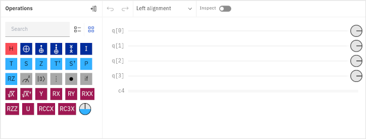

---
### Le composer

Sur cette page, nous trouvons :

- Les lignes horizontales correspondant aux **5 qubits** dont nous disposons.
- A droite, nous trouvons les **portes logiques** que nous plaçons par *drag & drop*.

Les **qubits** sont tous initialement à l'état *|0>*. Nous pouvons changer leur état avec la porte **X** qui inverse l'état d'un qubit.

De plus, il faut toujours **effectuer une mesure** à la fin de notre partition pour pouvoir l'exécuter.

Lorsque nous effectuons une mesure, nous obtenons le résultat sous forme d'un **bit classique**. Nous disposons ainsi de 5 qubits et 5 cbits, les bits classiques qui contiennent le résultat de notre calcul.

Lorsque nous avons composé notre partition, nous pouvons l'exécuter sur un **simulateur** ou sur un **processeur quantique**.

---
### Exemple de partition

Par exemple, si nous voulons laisser le premier qubit à l'état *|0>* et faire passer le second à l'état *|1>*, puis réaliser une mesure de ces qubits, nous composerons :

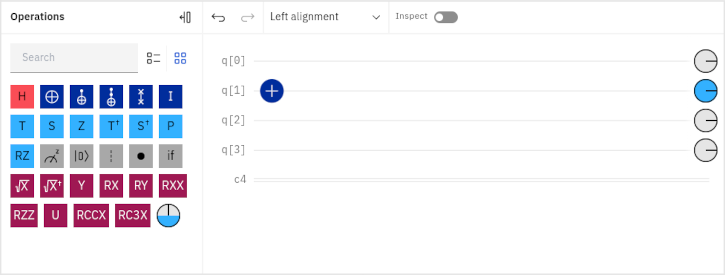

Après avoir cliqué sur **Simulate**, nous obtenons la page suivante :

---
### Exemple de résultat

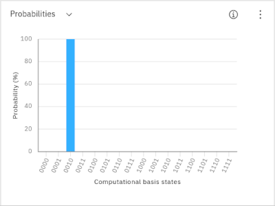

Ce résultat se présente sous la forme d'un histogramme où :

- **00010** est l'état des 5 qubits.
- **1.000** est la proportion de ce résultat.

Dans la représentation de l'état après la mesure, le premier qubit est le plus à droite.

Ce résultat est probabiliste comme toute mesure quantique.

---
### Opérateur de superposition

La porte **H** (pour *Hadamard*) transforme le qubit *|0>* en un état de superposition de *|0>* et de *|1>* à égale probabilité. Ainsi, la partition suivante :


Donne le résultat suivant :

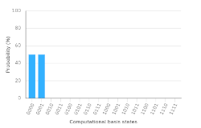

Nous mesurons bien (quasiment) autant de *|0>* que de *|1>*.

---
### Porte quantique multiple

Pour pouvoir réaliser des calculs intéressants, il nous faut disposer de portes capables de réaliser des opérations **conditionnelles**. C'est la cas de la porte **CNOT** (pour *controlled not*) qui inverse l'état du second qubit si le premier est à *|1>* et ne fait rien sinon.

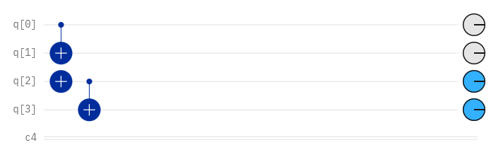

Ce qui donne **00** (pour les deux premières lignes) et **11** (pour les deux suivantes).

---
### Intrication

Nous pouvons intriquer deux qubits avec le circuit suivant :

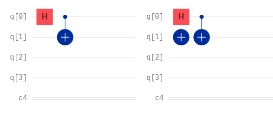

Ce qui donne **00** ou **11** avec la même probabilité pour le premier circuit, et **01** ou **10** avec le même probabilité, pour le deuxième circuit.

Dans le premier cas, les deux qubits ont la même valeur, dans le deuxième, ils ont des valeurs inverses. Ils sont donc **intriqués**.

---
Situation fin 2017
------------------

### IBM

IBM travaille sur les ordinateurs quantiques depuis plus de 35 ans.

- En mais 2016, IBM a dévoilé un **ordinateur quantique à 5 qubits**, accessible au grand public par internet.
- En mars 2017, IBM a ouvert une division commerciale, **IBM Q**, pour développer et vendre du calcul quantique par le cloud.
- En mai 2017, IBM a annoncé deux nouveaux prototypes de processeurs quantiques, à **16 et 17 qubits**.

IBM espère à terme développer un processeur quantique à **50 qubits**, pour atteindre la **suprématie quantique**. Un tel processeur serait plus puissant que tous les ordinateurs classiques développés jusqu'à présent.

---
### D-Wave Systems

D-Wave est un entreprise Canadienne pionnière en informatique quantique.

- En 2007, elle réalise un premier ordinateur quantique de démonstration à **16 qubits**.
- En 2011, elle vend un ordinateur quantique à **128 qubits**, le D-Wave One, pour *10 millions* de dollars à *Lockeed Martin*.
- En 2013, elle vend une machine à **512 qubits**, le D-Wave Two, à un laboratoire d'intelligence artificielle quantique mis en place par la *NASA*, *Google* et des universités Américaines.
- En 2015, elle passe la barrière du **millier de qubits** avec son ordinateur quantique D-Wave 2X.
- En 2017, elle vend une machine à **2000 qubits**, le D-Wave 2000Q, à une entreprise de sécurité informatique, *Temporal Defense Systems*.

Les machines D-Wave sont cependant critiquées car elles utilisent un procédé appelé **Quantum Annealing** qui est pour certains une impasse pour le calcul quantique. Cette technologie ne permet de résoudre que des **problèmes d'optimisation**.

---
### Google

Google est un client de D-Wave, mais a aussi développé sa propre technologie de calcul quantique. Cette technologie est un **hybride** entre celle d'IBM et celle de D-Wave.

- En juin 2017, Google a testé une machine à **20 qubits** basée sur sa propre technologie.
- D'ici à la fin 2017, Google espère tester une machine à **49 qubits**, approchant ainsi de la **suprématie quantique**.

Google **investit massivement** dans l'ordinateur quantique. Dans un article de mars 2017, soit le même mois où IBM annonçait *IBM Q*, de la revue Nature, des ingénieurs travaillant chez Google ont prédit que *dans quelques années, les ordinateurs quantiques seront plus puissants que tout ordinateur classique pour réaliser certaines tâches*.

---
### Microsoft, Intel, Alibaba et Atos

Microsoft travaille sur les ordinateurs quantiques avec une initiative appelée **Station Q**, basée essentiellement sur une technologie appelée *topological quantum computing*.

En décembre 2016, Intel a révélé qu'il travaille sur la réalisation de **puces quantiques sur silicium**.

En juillet 2016, Alibaba, le géant du commerce en ligne Chinois, s'est associé avec l'académie des sciences Chinoise pour mettre sur pied un laboratoire de calcul quantique, le **Alibaba Quantum Computing Laboratory**.

En juillet 2017, Atos annonce son **Atos Learning Machine**, un ordinateur classique capable de simuler 40 qubits. Il permet aux chercheurs et développeurs de travailler sur des algorithmes quantiques.

---
Perspectives
------------

Il existe beaucoup de problèmes dont la **complexité est exponentielle**. Un exemple simple est le placement de convives autour d'une table : pour *3* convives, il y a *3 x 2 x 1 = 3! = 6* possibilités. Pour *10* convives, nous sommes à *3.628.800*, soit plus de *3* millions !

On rencontre ce type de complexité exponentielle dans les problèmes suivants :

- **Optimisation** : on imagine bien que l'optimisation des livraisons d'Amazon dans une ville comme New York est un problème qui est en même temps extrêmement complexe et d'une grande importance.
- **Chimie** : la modélisation des électrons dans les molécules, qui sont attirés par les noyaux et se repoussent entre eux devient vite très complexe lorsqu'on augmente le nombre de ces électrons.

Ces problèmes sont hors de portée des ordinateurs classiques. Mais avec une accélération d'un rapport de **1 million de millards**, ils sont à portée des ordinateurs quantiques.

---
### Révolution Quantique

L'accélération que l'on peut attendre de l'ordinateur quantique pour la résolution de ces problèmes est d'une telle ampleur, que **ce n'est plus une évolution mais une révolution**.

On attend ainsi de la mise en œuvre des ordinateurs quantiques des progrès significatifs dans les domaines suivants :

- La création de nouveaux médicaments.
- La création de nouveaux matériaux.
- L'optimisation à grande échelle.

On comprend donc que les entreprises les plus innovantes en informatique s'intéressent à l'informatique quantique. Et l'on peut s'attendre à des percées significatives dans les **cinq prochaines années**.

---
Pour aller plus loin
--------------------

Pour comprendre en profondeur le fonctionnement des ordinateurs quantiques, il faut commencer par se familiariser avec la physique quantique. Je conseille donc de lire l'ouvrage de *Leonard Susskind* **Le minimum théorique, Mécanique Quantique**.

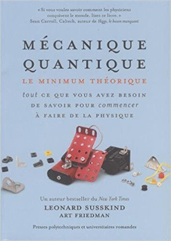

---
### The Quantum Experience

On pourra ensuite expérimenter avec l'ordinateur quantique d'IBM sur le site web :

```bash
http://quantumexperience.ng.bluemix.net
```

L'inscription est gratuite et ouverte à tout le monde. Le site propose de la documentation en ligne, pour les débutants et les utilisateurs confirmés.

En plus de l'interface graphique du *composer*, on peut aussi utiliser le langage de programmation *Qasm* ou bien une API Python.

---
Merci pour votre attention
==========================

Des Questions ?
---------------
